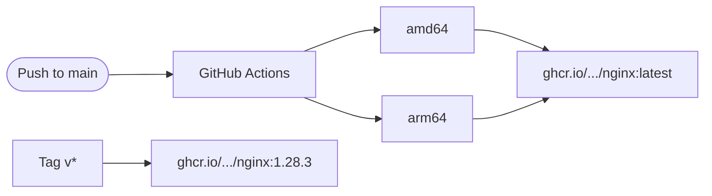

# nginx

[](LICENSE)
[](https://github.com/aprakasa/nginx/actions/workflows/build.yml)
[](https://nginx.org/)
[](https://github.com/aprakasa/nginx/pkgs/container/nginx)

Custom nginx Docker image compiled from source with WordPress-optimized modules, published to GHCR.

## Tags

| Tag | Description |
|-----|-------------|
| `ghcr.io/aprakasa/nginx:latest` | Latest build from main |
| `ghcr.io/aprakasa/nginx:1.28.3` | Pinned version |
| `ghcr.io/aprakasa/nginx:1.28` | Minor version (latest patch) |

All tags support **linux/amd64** and **linux/arm64**.

## CI Pipeline



## Included Modules

| Module | Description |
|--------|-------------|
| [ngx_brotli](https://github.com/google/ngx_brotli) | Brotli compression |
| [ngx_cache_purge](https://github.com/nginx-modules/ngx_cache_purge) | FastCGI cache purge |
| [headers-more-nginx-module](https://github.com/openresty/headers-more-nginx-module) | Set/clear HTTP headers |
| [echo-nginx-module](https://github.com/openresty/echo-nginx-module) | Shell-style utilities in config |
| [ngx_devel_kit](https://github.com/simpl/ngx_devel_kit) | Nginx Development Kit |
| [set-misc-nginx-module](https://github.com/openresty/set-misc-nginx-module) | Additional set_* directives |
| [memc-nginx-module](https://github.com/openresty/memc-nginx-module) | Memcached upstream |
| [redis2-nginx-module](https://github.com/openresty/redis2-nginx-module) | Redis 2.0 upstream |
| [srcache-nginx-module](https://github.com/openresty/srcache-nginx-module) | Transparent subrequest caching |
| [ngx_http_redis](https://github.com/centminmod/ngx_http_redis) | Simple Redis handler |
| [ngx_http_substitutions_filter_module](https://github.com/yaoweibin/ngx_http_substitutions_filter_module) | Regex response substitution |
| [nginx-module-vts](https://github.com/vozlt/nginx-module-vts) | Virtual host traffic status |
| [ipscrub](https://github.com/masonicboom/ipscrub) | IP anonymization for logs |

## What's Included

**Base**: `alpine:3.23` with multi-stage build — compile in builder, minimal runtime (~14 MB vs 62 MB for `nginx:alpine`).

**Performance**: Thread pools (`aio threads`), Cloudflare zlib (amd64), dynamic TLS records patch, HTTP/3 (QUIC), FastCGI cache path pre-configured, rate limiting zones, connection pooling, and WordPress-specific cache maps — all baked into the default config.

**Default Config** (baked into image, overridable via volume mount):
- `conf/nginx.conf` — Production-tuned with thread pools, FastCGI cache, rate limiting, gzip, maps for WordPress cache bypass

**Ports**: 80/TCP (HTTP), 443/TCP (HTTPS), 443/UDP (HTTP/3)

## Usage

```sh
docker pull ghcr.io/aprakasa/nginx:latest
docker run -d -p 80:80 -p 443:443 -p 443:443/udp ghcr.io/aprakasa/nginx:latest
```

### With custom config

```sh
docker run -d \
  -p 80:80 -p 443:443 -p 443:443/udp \
  -v /path/to/nginx.conf:/etc/nginx/nginx.conf:ro \
  -v /path/to/conf.d:/etc/nginx/conf.d:ro \
  -v /path/to/html:/usr/share/nginx/html:ro \
  ghcr.io/aprakasa/nginx:latest
```

### Docker Compose

```yaml
services:
  nginx:
    image: ghcr.io/aprakasa/nginx:latest
    ports:
      - "80:80"
      - "443:443"
      - "443:443/udp"
    volumes:
      - ./nginx/nginx.conf:/etc/nginx/nginx.conf:ro
      - ./nginx/snippets:/etc/nginx/snippets:ro
      - html_data:/var/www/html:ro
    restart: unless-stopped
```

## Building Locally

```sh
docker build -t custom-nginx .

# Specific platform
docker build --platform linux/amd64 -t custom-nginx .
```

## License

[MIT](LICENSE)
